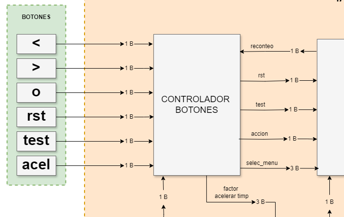

## requerimientos de diseño

## estructura 


### ENTRADAS INTERACCIÓN  
#### Botones
#### sensor 


### FMS
#### MODOS DE OPERACION
#### ESTADOS 
#### INTERACCIÓN Y TRANSICIONES
#### TEMPORIZADORES    
<<<<<<< HEAD


### VISUALIZACIÓN   
#### lcd
caja negra 
usa una fms


# ENTREGA FINAL DE PROYECTO 

# DISEÑO DE TAMAGOTCHI EN FPGA

Juan Manuel barrero mendoza\
Brayan Daniel Saidiza Amaya\
David Camilo Valbuena Molano


## OBJETIVO

Desarrollar un sistema de Tamagotchi en FPGA (Field-Programmable Gate Array) que simule el cuidado de una mascota virtual. El diseño incorporará una lógica de estados para reflejar las diversas necesidades y condiciones de la mascota, junto con mecanismos de interacción a través de sensores y botones que permitan al usuario cuidar adecuadamente de ella.

## REQUERIMIENTOS DE DISEÑO 

El alcance del proyecto se centra en la creación de un sistema básico de Tamagotchi, que incluirá:

Una interfaz de usuario operada mediante botones físicos, en este caso cuenta con 6 botones los cuales son (2) de navegación, (1) de selección,(1) botón para el modo prueba (test),(1) boton para reinicio (reset) y (1) boton de aceleración de tiempo.   

Al menos un sensor para ampliar las formas de interacción, en este caso un sensor de color el cual tendrá 2 funciones la primera alimentar el tamagotchi dependiendo del color,  y la segunda es para hacerlo dormir dependiendo la luminosidad que haya.

Un sistema de visualización para representar el estado actual y las necesidades de la mascota virtual, en este caso una pantalla LCD20x4, 4 filas y 20 columnas en las cuales apareceran el estado en el que se encuentra el tamagotchi y los valores de cada estado.

Este proyecto se diseñará e implementará utilizando la FPGA ciclone IV, con restricciones claras en términos de recursos de hardware disponibles. La implementación se detallará en Verilog.

## ESTRUCTURA


El proyecto sigue una estructura de "caja negra", en la que se manejan entradas y salidas específicas.

Entradas: Botones y sensor de color

Salida: Pantalla LCD 20x4

El sistema realiza las siguientes funciones principales:

Leer las entradas\
Actualizar los estados\
Visualizar o reflejar los estados en la salida

Partiendo de lo anterior podemos dividir la estructura en tres subcomponentes clave:

Entradas o Interacciones\
Máquina de Estados Finita (FSM)\
Salida o Visualización

Comenzaremos entonces desglosando la estructura de la entrada. 

### ENTRADAS O INTERACCIONES

#### BOTONES


La interacción usuario-sistema se realizará mediante los siguientes botones configurados:


| Botón      | Especificación        | Descripción                         |
|------------|-------------|-------------------------------------|
| Reset      | Pulsador externo  | Reestablece el Tamagotchi a un estado inicial conocido al mantener pulsado el botón durante al menos 5 segundos. Este estado inicial simula el despertar de la mascota con salud óptima.      |
| Test  | Pulsador externo   | Activa el modo de prueba al mantener pulsado por al menos 5 segundos, permitiendo al usuario navegar entre los diferentes estados del Tamagotchi.|
| Navegación (2)  | Pulsador externo   | Permiten desplazarse entre pantallas(Estados) del Tamagotchi.En el modo Test funcionan de la misma manera.   |
| Selección | Pulsador externo  | Selección: Al pulsarse permite al usuario unicamente aumentar el valor del sistema de puntos del respectivo estado (subir la puntuación) hasta el valor máximo y luego se detiene. En el modo test una vez que llega al máximo, si se vuelve a pulsar, va al valor mínimo de la puntuación y empieza a aumentar nuevamente si se pulsa (Puntuación rotativa).      |
| Acelerador de Tiempo (Acel)   | Pulsador externo  |  Al presionarse le permite al usuario aumentar el tiempo en el que transcurren los eventos del tamagotchi en un determinado factor (x2,x4,x8,x16). |

#### ANTIRREBOTE

El antirrebote  

(SI ES NECESARIO COLOCAR EXTRACTOS DEL CODIGO)

```verilog


```

#### SENSOR DE COLOR TCS3200


Para integrar al Tamagotchi con el entorno real y enriquecer la experiencia de interacción, se incorporará al menos un sensor que modifique el comportamiento de la mascota virtual en respuesta a estímulos externos. El sensor permitirá simular condiciones ambientales y actividades que afecten directamente el bienestar de la mascota.

El sensor a implementar será un sensor de color con el que se generarán las dinámicas entre el usuario y la mascota; se eligió el módulo TCS3200 por su bajo costo y fácil obtención en el mercado.

Este módulo tiene una matriz de fotodiodos de 8 × 8. Dieciséis fotodiodos tienen filtros azules, 16 fotodiodos tienen filtros verdes, 16 fotodiodos tienen filtros rojos y 16 fotodiodos son transparentes sin filtros. Cada grupo de fotodiodos se activará por separado para identificar cada componente de la luz incidente. Mediante un conversor de corriente a frecuencia integrado, se convierte la señal de los fotodiodos en una señal cuadrada de frecuencia directamente proporcional a la intensidad de luz irradiada


### ENTRADAS DE CONFIGURACION DEL SENSOR DE COLOR
#### S0 Y S1 
permiten escalar la frecuencia de salida entre los valores de 2% 20% y 100%.
El rango de la frecuencia de salida típica es de 2 HZ ~ 500 KHZ.

| S0  | S1 | ESCALADO DE FRECUENCIA |
| ------------- | ------------- | ------------- |
| 0 | 0  | OFF |
| 0 | 1  | 2%  |
| 1 | 0  | 20%  |
| 1 | 1  | 100%  |

#### S2 Y S3 
Permite seleccionar el color a detectar ya que contiene fotodiodos con diferentes filtros ROJO VERDE AZUL Y SIN FILTRO se selecciona el color a leer mediante las entradas S2 y S3
| S2  | S3 | COLOR |
| ------------- | ------------- | ------------- | 
| 0 | 0  | ROJO  |
| 0 | 1  | AZUL  |
| 1 | 0  | SIN FILTRO  |
| 1 | 1  | VERDE |

#### OE
Permite habilitar o deshabilitar la salida del sensor de color. 

| OE  | ESTADO |
| ------------- | ------------- |
| 0  | activa el sensor de color  |
| 1  | desactiva el sensor de color |

### DRIVER 
Se debe generar un controlador que entregue un valor independiente de cada componente de color (ROJO ,VERDE Y AZUL) apartir del sensado de varias señales de entrada 


Nuestro controlador debera contar con 5 salidas de control que permitan configurar el sensor de color;La escala de frecuencia (C-S0 y C-S1) sera estable por lo que siempre usaremos la escala de 100% manteniendo la frecuencia de salida del sensor entre 2 HZ ~ 500 KHZ pero usaremos estas ademas para salidas para activar o desactivar el sensor;

La salida LED se encargara de habilitar o deshabilitar los led de iluminación que están en el sensor se mantendrá en 0 hasta el momento en que se decida sensar 

Las salidas C-S2 y C-S3 se modificaran cuando se decida censar pasando por los cuatro posibles valores para conocer la intensidad de luz incidente y la de los componentes de color por aparte 

La entrada de datos es de un bit pues la salida del sensor es una onda cuadrada y con la entrada serial podemos calcular su frecuencia mediante un contador y asi posteriormente determinar el color que se esta leyendo.

Se realizaran mediciones aplicando cada uno de los filtros y se almacena el valor de la frecuencia en un banco de registros pues luego tienen que ser comparados los valores de color con el de referencia o sin filtro.la frecuencia de las señales de (ROJO VERDE AZUL) dependera de la proporcion de color pues 


Un reloj que permita medir el tiempo entre cada franco de subida de la señal de salida del sensor.

las salidas seran 3 cada una representativa de un color ROJO VERDE AZUL cada una de 2 bits inicialmente 


Para facilitar el diseño de la maquina de estados y reducir entradas se implementa un comparador con una salida de 2 bits para la cual cada combinación sera un color 00 rojo, 01 azul,10 verde y 11 blanco.


### FSM


#### MODOS DE OPERACION
#### ESTADOS 
#### INTERACCIÓN Y TRANSICIONES
#### TEMPORIZADORES    


### SALIDA O VISUALIZACIÓN 

#### PANTALLA LCD 20X4 2004A 


## MANUEL AQUI TOCA COLOCAR LA CAJA NEGRA CORRESPONDIENTE AL FUNCIONAMIENTO DE LA PANTALLA (SOLO UNA IMGAGEN) Y SE COLOCAN SECCION O SECCIONES DEPENDIENDO QUE MAS ES LO QUE TIENE LA PANTALLA POR EJEMPLO DESPUES DE LO QUE YA ESTA ESCRITO, HAY UN ESPACIO PARA UNA SECCION QUE SE VA A LLAMAR "FMS DE LA PANTALLA" EN DONDE EXPLICA COMO FUNCIONA Y QUE TIENE 

La pantalla a utilizar sera una LCD 20X4 2004 ya que posee una mayor capacidad para mostrar caracteres, animaciones y texto que una matriz 8x8 y los displays de 7 segmentos.Esta pantalla posee 4 lineas y 20 caracteres por cada una de estas y cada carácter ocupa una celda de 5x8 puntos también, utiliza un conector de 16 pines para su interfaz, donde se incluyen pines para alimentación, datos y control.


Los pines de esta pantalla son los siguientes:


**VSS (Pin 1):** Tierra (GND). Conectado a la referencia de tierra del sistema.

**VDD (Pin 2):** Voltaje de alimentación positivo (VCC). Normalmente 5V DC.

**VO (Pin 3):** Entrada de ajuste de contraste. Se conecta a un potenciómetro para ajustar el contraste de la pantalla.

**RS (Pin 4):** Registro de selección (Register Select). Define si se envían datos o comandos al LCD.

0: Modo comando

1: Modo datos

**RW (Pin 5):** Lectura/Escritura (Read/Write). Define si se está leyendo o escribiendo en el LCD.

0: Modo escritura

1: Modo lectura

**E (Pin 6):** Habilitar (Enable). Permite al LCD captar los datos presentes en los pines de datos.

**D0-D7 (Pines 7-14):** Pines de datos (Data Pins). Usados para enviar datos y comandos al LCD.

**D0-D3 (Pines 7-10):** Pines de datos menos significativos (usados en modo de 8 bits).

**D4-D7 (Pines 11-14):** Pines de datos más significativos (usados en modo de 4 bits o 8 bits).

**A/VSS (Pin 15):** Anodo de retroiluminación (si está presente). Conectado a VCC a través de una resistencia limitadora de corriente.

**K/VDD (Pin 16):** Cátodo de retroiluminación (si está presente). Conectado a GND.


# SECCION EXPLICANDO COMO FUNCIONA LA FMS DE LA PANTALLA


