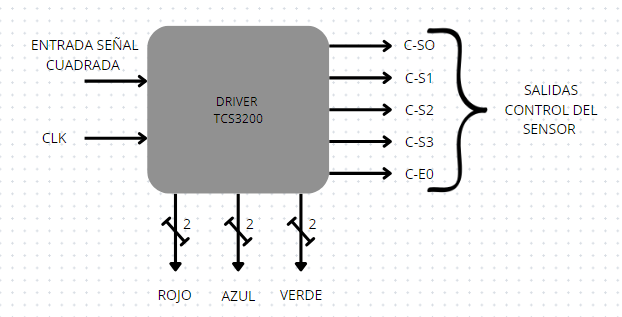
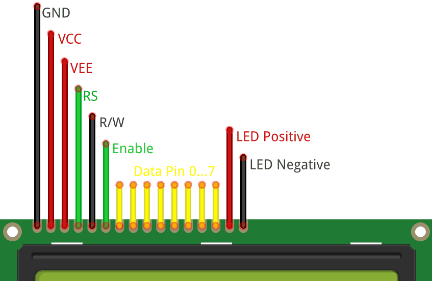

# Entrega 1 del proyecto WP01
<<<<<<< Updated upstream
## 1.Objetivo 
Desarrollar un sistema de Tamagotchi en FPGA (Field-Programmable Gate Array) que simule el cuidado de una mascota virtual. El diseño incorporará una lógica de estados para reflejar las diversas necesidades y condiciones de la mascota, junto con mecanismos de interacción a través de sensores y botones que permitan al usuario cuidar adecuadamente de ella.

## 2. Especificación de los sistemas que conforman el proyecto

### 2.1 Botones 

La interacción usuario-sistema se realizará mediante los siguientes botones configurados:

**Reset:** Reestablece el Tamagotchi a un estado inicial conocido al mantener pulsado el botón durante al menos 5 segundos. Este estado inicial simula el despertar de la mascota con salud óptima.

**Test:** Activa el modo de prueba al mantener pulsado por al menos 5 segundos, permitiendo al usuario navegar entre los diferentes estados del Tamagotchi con cada pulsación.

**Navegación (2):** Permiten desplazarse entre pantallas(Estados) del Tamagotchi.En el modo Test funcionan de la misma manera.

**Selección:** Al pulsarse permite al usuario unicamente aumentar el valor del sistema de puntos del respectivo estado (subir la puntuación) hasta el valor máximo y luego se detiene. En el modo test una vez que llega al máximo, si se vuelve a pulsar, va al valor mínimo de la puntuación y empieza a aumentar nuevamente si se pulsa (Puntuación rotativa).

**Acelerador de Tiempo (Acel):** Al presionarse le permite al usuario aumentar el tiempo en el que transcurren los eventos del tamagotchi en un determinado factor (x2,x4,x8,x16). 

### 2.2 Sistema de Sensado

Para integrar al Tamagotchi con el entorno real y enriquecer la experiencia de interacción, se incorporará al menos un sensor que modifique el comportamiento de la mascota virtual en respuesta a estímulos externos. Los sensores permitirán simular condiciones ambientales y actividades que afecten directamente el bienestar de la mascota. Los siguientes son ejemplos de sensores y sus aplicaciones potenciales:

Sensor de Color: Permite al Tamagotchi “alimentarse” de colores específicos presentes en su entorno, cada uno asociado a diferentes tipos de nutrientes o efectos:
Nutrición Variada: La identificación de diferentes colores se traduce en una variedad de alimentos consumidos, impactando positiva o negativamente en la salud y el estado anímico del Tamagotchi.

## SENSOR DE COLOR TCS3200

El sensor a implementar será un sensor de color con el que se generarán las dinámicas entre el usuario y la mascota; se eligió el módulo TCS3200 por su bajo costo y fácil obtención en el mercado.

Este módulo tiene una matriz de fotodiodos de 8 × 8. Dieciséis fotodiodos tienen filtros azules, 16 fotodiodos tienen filtros verdes, 16 fotodiodos tienen filtros rojos y 16 fotodiodos son transparentes sin filtros. Cada grupo de fotodiodos se activará por separado para identificar cada componente de la luz incidente. Mediante un conversor de corriente a frecuencia integrado, se convierte la señal de los fotodiodos en una señal cuadrada de frecuencia directamente proporcional a la intensidad de luz irradiada

### ENTRADAS DE CONFIGURACION DEL SENSOR DE COLOR
#### S0 Y S1 
permiten escalar la frecuencia de salida entre los valores de 2% 20% y 100%.
El rango de la frecuencia de salida típica es de 2 HZ ~ 500 KHZ.

| S0  | S1 | ESCALADO DE FRECUENCIA |
| ------------- | ------------- | ------------- |
| 0 | 0  | OFF |
| 0 | 1  | 2%  |
| 1 | 0  | 20%  |
| 1 | 1  | 100%  |

#### S2 Y S3 
Permite seleccionar el color a detectar ya que contiene fotodiodos con diferentes filtros ROJO VERDE AZUL Y SIN FILTRO se selecciona el color a leer mediante las entradas S2 y S3
| S2  | S3 | COLOR |
| ------------- | ------------- | ------------- | 
| 0 | 0  | ROJO  |
| 0 | 1  | AZUL  |
| 1 | 0  | SIN FILTRO  |
| 1 | 1  | VERDE |

#### OE
Permite habilitar o deshabilitar la salida del sensor de color. 

| OE  | ESTADO |
| ------------- | ------------- |
| 0  | activa el sensor de color  |
| 1  | desactiva el sensor de color |

### DRIVER 
Se debe generar un controlador que entregue un valor independiente de cada componente de color (ROJO ,VERDE Y AZUL) apartir del sensado de varias señales de entrada 

Nuestro controlador debera contar con 5 salidas de control que permitan configurar el sensor de color;La escala de frecuencia (C-S0 y C-S1) sera estable por lo que siempre usaremos la escala de 100% manteniendo la frecuencia de salida del sensor entre 2 HZ ~ 500 KHZ pero usaremos estas ademas para salidas para activar o desactivar el sensor;

La salida C-OE se encargara de habilitar o deshabilitar la señal de salida del sensor de color (activo en 0),por lo que la mantendremos en 1 hasta el momento que se decida sensar para que este no genere ruido.

Las salidas C-S2 y C-S3 se modificaran cuando se decida censar pasando por los cuatro posibles valores para conocer la intensidad de luz incidente y la de los componentes de color por aparte 

La entrada de datos es de un bit pues la salida del sensor es una onda cuadrada y con la entrada serial podemos calcular su frecuencia mediante un contador y asi posteriormente determinar el color que se esta leyendo.

Se realizaran mediciones aplicando cada uno de los filtros y se almacena el valor de la frecuencia en un banco de registros pues luego tienen que ser comparados los valores de color con el de referencia o sin filtro.la frecuencia de las señales de (ROJO VERDE AZUL) dependera de la proporcion de color pues 

Un reloj que permita medir el tiempo entre cada franco de subida de la señal de salida del sensor.

las salidas seran 3 cada una representativa de un color ROJO VERDE AZUL cada una de 2 bits inicialmente 

Para facilitar el diseño de la maquina de estados y reducir entradas se implementa un comparador que 
>>>>>>> Stashed changes

### 2.3 Sistema de Visualización

Pantalla LCD: Esencial para representar visualmente el estado actual del Tamagotchi, incluyendo emociones y necesidades básicas. También sirve para  mostrar niveles y puntuaciones específicas de la condición en la que se encuentra.

## PANTALLA LCD 20X4 2004A 

La pantalla a utilizar sera una LCD 20X4 2004 ya que posee una mayor capacidad para mostrar caracteres, animaciones y texto que una matriz 8x8 y los displays de 7 segmentos.Esta pantalla posee 4 lineas y 20 caracteres por cada una de estas y cada carácter ocupa una celda de 5x8 puntos también, utiliza un conector de 16 pines para su interfaz, donde se incluyen pines para alimentación, datos y control.

Los pines de esta pantalla son los siguientes:

**VSS (Pin 1):** Tierra (GND). Conectado a la referencia de tierra del sistema.

**VDD (Pin 2):** Voltaje de alimentación positivo (VCC). Normalmente 5V DC.

**VO (Pin 3):** Entrada de ajuste de contraste. Se conecta a un potenciómetro para ajustar el contraste de la pantalla.

**RS (Pin 4):** Registro de selección (Register Select). Define si se envían datos o comandos al LCD.

0: Modo comando

1: Modo datos

**RW (Pin 5):** Lectura/Escritura (Read/Write). Define si se está leyendo o escribiendo en el LCD.

0: Modo escritura

1: Modo lectura

**E (Pin 6):** Habilitar (Enable). Permite al LCD captar los datos presentes en los pines de datos.

**D0-D7 (Pines 7-14):** Pines de datos (Data Pins). Usados para enviar datos y comandos al LCD.

**D0-D3 (Pines 7-10):** Pines de datos menos significativos (usados en modo de 8 bits).

**D4-D7 (Pines 11-14):** Pines de datos más significativos (usados en modo de 4 bits o 8 bits).

**A/VSS (Pin 15):** Anodo de retroiluminación (si está presente). Conectado a VCC a través de una resistencia limitadora de corriente.

**K/VDD (Pin 16):** Cátodo de retroiluminación (si está presente). Conectado a GND.

## 3. Arquitectura del Sistema

### 3.1 Diagramas de Bloques 
BORRAR (Incluiría un diagrama básico que muestre la FPGA, la pantalla, los botones de entrada y cualquier otro componente clave).
#### 3.1.1 Caja Negra

#### 3.1.2 Funcional

### 3.2 Descripción de Componentes

### 3.3 Interfaces 

Comunicación entre la FPGA y la pantalla. Entradas digitales para los botones. Comunicación entre la FPGA y el sensor.

## 4 Especificaciones de Diseño Detalladas

### 4.1 Modos de operación
#### 4.1.1 Modo Test
El modo Test permite a los usuarios y desarrolladores validar la funcionalidad del sistema y sus estados sin necesidad de seguir el flujo de operación normal. En este modo, se pueden forzar transiciones de estado específicas mediante interacciones simplificadas, como pulsaciones cortas de botones, para verificar las respuestas del sistema y la visualización. Este modo es esencial durante la fase de desarrollo para pruebas rápidas y efectivas de nuevas características o para diagnóstico de problemas.

Activación: Se ingresa al modo Test manteniendo pulsado el botón “Test” por un periodo de 5 segundos.
Funcionalidad: Permite la navegación manual entre los estados del Tamagotchi, ignorando los temporizadores o eventos aleatorios, para observar directamente las respuestas y animaciones asociadas.

#### 4.1.2 Modo Normal 
El Modo Normal es el estado de operación estándar del Tamagotchi, donde la interacción y respuesta a las necesidades de la mascota virtual dependen enteramente de las acciones del usuario.

Activación: El sistema arranca por defecto en el Modo Normal tras el encendido o reinicio del dispositivo. No requiere una secuencia de activación especial, ya que es el modo de funcionamiento predeterminado.

Funcionalidad: Los usuarios interactúan con la mascota a través de botones y, potencialmente, sensores para satisfacer sus necesidades básicas. La mascota transita entre diferentes estados (por ejemplo, Hambriento, Feliz, Dormido, Enfermo) en respuesta a las acciones del usuario y al paso del tiempo. El sistema proporciona retroalimentación inmediata sobre las acciones mediante la visualización.

#### 4.1.3 Modo Aceleración 
El modo Aceleración incrementa la velocidad a la que transcurren los eventos y el paso del tiempo dentro de la simulación del Tamagotchi, permitiendo a los usuarios experimentar ciclos de vida más rápidos y evaluar cómo las interacciones afectan al estado de la mascota en un periodo comprimido.

Activación: Se activa pulsando el botón dedicado a “Aceleración de Tiempo”, con cada pulsación aumentando la velocidad de simulación (por ejemplo, 2x, 4x, 8x, x16).
Funcionalidad: Todos los temporizadores internos y los ciclos de eventos operan a una velocidad incrementada, acelerando la necesidad de interacciones como alimentar, jugar o curar.

### 4.2 Estados y Transiciones

#### 4.2.1 Estados

El Tamagotchi operará a través de una serie de estados que reflejan las necesidades físicas y emocionales de la mascota virtual, a saber:

Hambriento: Este estado alerta sobre la necesidad de alimentar a la mascota. La falta de atención a esta necesidad puede desencadenar un estado de enfermedad.

Diversión: Denota la necesidad de entretenimiento de la mascota. La inactividad prolongada puede llevar a estados de aburrimiento o tristeza.

Descansar: Identifica cuando la mascota requiere reposo para recuperar energía, especialmente después de períodos de actividad intensa o durante la noche, limitando la interacción del usuario durante estas fases.

Salud: va a niveles de enfermo por el descuido en el cuidado de la mascota, requiriendo intervenciones específicas para su recuperación.

Feliz: Refleja el bienestar general de la mascota como resultado de satisfacer adecuadamente sus necesidades básicas.

#### 4.2.2 Transiciones

#### Temporizadores
Se implementarán temporizadores para simular el avance temporal, afectando las necesidades básicas del Tamagotchi. A medida que el tiempo progresa, ciertas necesidades como el hambre incrementarán de forma gradual, requiriendo intervención del usuario para suministrar alimento a la mascota y mantener su estado de salud óptimo.

#### Interacciones y Eventos Aleatorios

Las transiciones entre diferentes estados de la mascota se desencadenarán por interacciones directas del usuario, utilizando botones y sensores. Estas acciones permitirán al usuario influir activamente en el bienestar y comportamiento de la mascota virtual.

#### Sistema de Niveles o Puntos

Se desarrollará un sistema de niveles o puntuación que reflejará la calidad del cuidado proporcionado al Tamagotchi. Aspectos como el nivel de hambre y felicidad fluctuarán en una escala de 1 a 5, donde acciones positivas como alimentar o interactuar con la mascota incrementarán dichos niveles, mientras que la inactividad o negligencia resultará en su disminución. Este mecanismo brindará retroalimentación constante al usuario sobre la condición actual de la mascota virtual.

